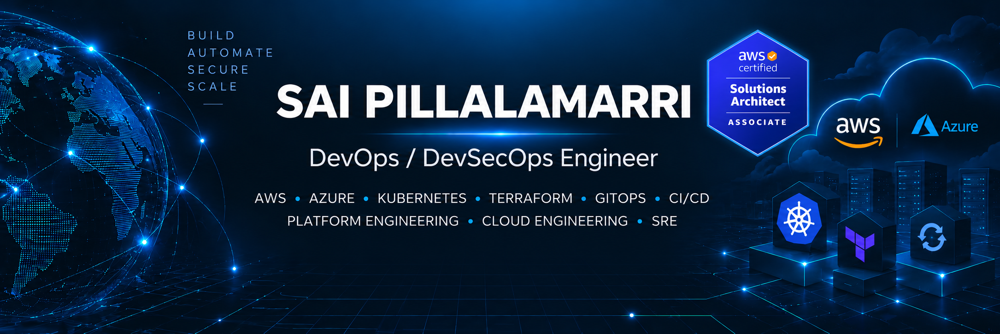

<p align="center">
  
</p>

<p align="center">
  <a href="https://www.linkedin.com/in/saipillalamarri">
    
  </a>
  <a href="mailto:sai.pillalamarri.aws@gmail.com">
    
  </a>
</p>

## About Me

I'm a DevOps / DevSecOps Engineer with 5+ years of experience working across cloud infrastructure, CI/CD, Kubernetes, automation, security, and production operations on AWS and Azure.

My work focuses on Infrastructure as Code, deployment automation, GitOps, secure software delivery, observability, and reliability.

I work across the delivery path from infrastructure provisioning and CI/CD pipelines to container platforms, security controls, monitoring, incident response, and operational automation.

I enjoy troubleshooting systems from symptom to root cause, then improving the platform so the same failure is easier to detect, recover from, or prevent.

## Engineering Focus

- AWS and Azure cloud infrastructure
- Kubernetes and Amazon EKS
- Infrastructure as Code with Terraform
- CI/CD with GitHub Actions, Azure DevOps, and Jenkins
- GitOps delivery with Argo CD
- Reusable infrastructure and deployment standards
- DevSecOps controls across code, containers, infrastructure, and software supply chain
- IAM, workload identity, secrets management, and cloud security controls
- Observability with Prometheus, Grafana, CloudWatch, Azure Monitor, and ELK
- Incident response, root cause analysis, and production troubleshooting
- Automation with Python, Boto3, and Bash
- Backup, recovery, cost optimisation, and operational reliability

## Tech Stack

### Cloud & Infrastructure


### Containers & GitOps


### CI/CD & Automation


### DevSecOps & Software Supply Chain


### Observability & Reliability


### Languages & Databases


## Career Snapshot

### Wipro — DevSecOps Engineer

**Jun 2023 – Present**

Working across AWS, Kubernetes, Terraform, GitHub Actions, Argo CD, security controls, observability, incident response, and infrastructure automation.

My focus includes secure application delivery, reusable infrastructure, production reliability, platform automation, troubleshooting, and reducing manual operational work.

### Virtusa — DevOps Engineer

**Apr 2021 – Mar 2023**

Worked across Azure and AWS environments using Azure DevOps, Jenkins, Terraform, Ansible, Docker, CloudWatch, Azure Monitor, Bash, and Python.

Supported CI/CD, infrastructure provisioning, deployment automation, releases, monitoring, backup, troubleshooting, and day-to-day production operations.

## Featured Engineering Projects

### AS Bank

An independent DevOps / DevSecOps engineering project built around a banking-style microservices platform.

The platform covers infrastructure provisioning, Kubernetes, GitOps, identity, secure software delivery, database lifecycle, workload security, environment automation, and operational reliability.

#### Engineering Implemented

- Layered Terraform with separate state and lifecycle boundaries
- Amazon EKS with Karpenter-based node provisioning
- GitOps deployment through Argo CD
- App-of-apps structure for platform and application workloads
- GitHub Actions CI with reusable workflows and path-aware execution
- Immutable ECR image releases using Git SHA tags and image digests
- SonarQube quality gates
- Trivy filesystem and container image scanning
- Gitleaks secret scanning
- OWASP ZAP baseline DAST
- Syft SBOM generation
- Cosign keyless container signing through GitHub OIDC
- Kyverno admission policies with image signature verification
- Pod Security Admission in restricted mode
- Kubernetes NetworkPolicies with default-deny controls
- External Secrets Operator with AWS Secrets Manager
- EKS Pod Identity for workload authentication
- PostgreSQL 16 databases on Amazon RDS
- Snapshot-based RDS teardown and restoration
- Amazon Cognito users, groups, clients, and OAuth2 scopes
- Spring Boot OAuth2/JWT resource-server security
- Negative security tests for authentication and authorization controls
- Horizontal Pod Autoscaling
- PodDisruptionBudgets
- Liveness, readiness, and startup probes
- Topology spread constraints
- Automated application release to GitOps pull-request promotion

### AS Bank Repositories

#### Infrastructure

[View AS Bank Infrastructure](https://github.com/sai-pillalamarri/as-bank-infra)

Terraform, AWS networking, EKS, Karpenter, IAM, RDS, Cognito, platform add-ons, infrastructure lifecycle, and environment automation.

#### GitOps

[View AS Bank GitOps](https://github.com/sai-pillalamarri/as-bank-gitops)

Argo CD desired state, Helm workloads, Kubernetes configuration, security controls, platform components, and environment-specific deployment configuration.

#### Application

[View AS Bank Application](https://github.com/sai-pillalamarri/as-bank-app)

Java/Spring Boot microservices, React frontend, OAuth2/JWT security, application CI, container builds, SBOM generation, image scanning, and signed releases.

**Stack:** AWS · EKS · Terraform · Kubernetes · Argo CD · GitHub Actions · Karpenter · RDS · Cognito · Java · Spring Boot · React · PostgreSQL · Kyverno · Trivy · Cosign

> **Scope note:** AS Bank is a learning project using synthetic data. The banking domain is used to exercise security, reliability, and platform engineering controls and does not represent production banking experience.

---

### E-Commerce Microservices Application

A microservices-based e-commerce application implemented through multiple stages of infrastructure and deployment automation.

The repositories show how the same application environment evolved from shell automation to configuration management, containerisation, and Infrastructure as Code on AWS.

```text
Shell Automation
      ↓
Ansible
      ↓
Docker
      ↓
Terraform
      ↓
AWS Infrastructure
```

### Shell Automation

[View Shell Automation Repository](https://github.com/sai-pillalamarri/shell-roboshop)

Automated Linux and application setup using Bash and AWS CLI.

The implementation covers EC2 provisioning, Route 53 updates, package installation, application deployment, service configuration, and systemd management.

**Technologies:** Bash · AWS CLI · EC2 · Route 53 · Linux · systemd

### Configuration Management with Ansible

[View Ansible Automation Repository](https://github.com/sai-pillalamarri/roboshop-ansible-v3)

Moved application configuration into reusable Ansible roles with shared variables, inventory-based targeting, and service-specific configuration.

This reduced repeated shell logic and made the environment easier to reproduce consistently.

**Technologies:** Ansible · YAML · Linux · AWS · Configuration Management

### Containerised Microservices

[View Docker Repository](https://github.com/sai-pillalamarri/roboshop-docker)

Containerised the application services and supporting dependencies using Docker and Docker Compose.

The implementation covers multi-stage builds, service networking, application dependencies, database initialization, persistent volumes, and local multi-service orchestration.

**Technologies:** Docker · Docker Compose · Microservices · MongoDB · Redis · MySQL · RabbitMQ

### AWS Infrastructure with Terraform

[View Terraform Infrastructure Repository](https://github.com/sai-pillalamarri/roboshop-dev-infra)

Built the AWS infrastructure using Terraform with separate infrastructure layers and reusable modules.

The environment covers:

- VPC networking
- Public and private subnets
- Security groups
- Bastion infrastructure
- Database infrastructure
- Internal Application Load Balancer
- Internet-facing Application Load Balancer
- EC2 application workloads
- Launch Templates
- Auto Scaling Groups
- ACM certificates
- Route 53 DNS
- CloudFront-related infrastructure
- Remote Terraform state
- Reusable Terraform modules

**Technologies:** AWS · Terraform · VPC · EC2 · ALB · Auto Scaling · ACM · Route 53 · CloudFront · Infrastructure as Code

## Certification

### AWS Certified Solutions Architect – Associate

AWS Certified Solutions Architect – Associate certification covering AWS architecture, secure design, resilient systems, networking, storage, compute, and cost-aware cloud solutions.

## GitHub Activity

## GitHub Activity

<p align="center">
  
</p>

<p align="center">
  
  
</p>

## Contribution Activity

<p align="center">
  <picture>
    <source
      media="(prefers-color-scheme: dark)"
      srcset="https://raw.githubusercontent.com/sai-pillalamarri/sai-pillalamarri/output/github-contribution-grid-snake-dark.svg"
    />
    <source
      media="(prefers-color-scheme: light)"
      srcset="https://raw.githubusercontent.com/sai-pillalamarri/sai-pillalamarri/output/github-contribution-grid-snake.svg"
    />
    
  </picture>
</p>

## Connect With Me

<p>
  <a href="https://www.linkedin.com/in/saipillalamarri">LinkedIn</a>
  •
  <a href="mailto:sai.pillalamarri.aws@gmail.com">Email</a>
</p>
